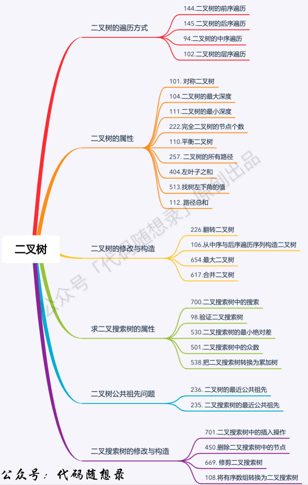
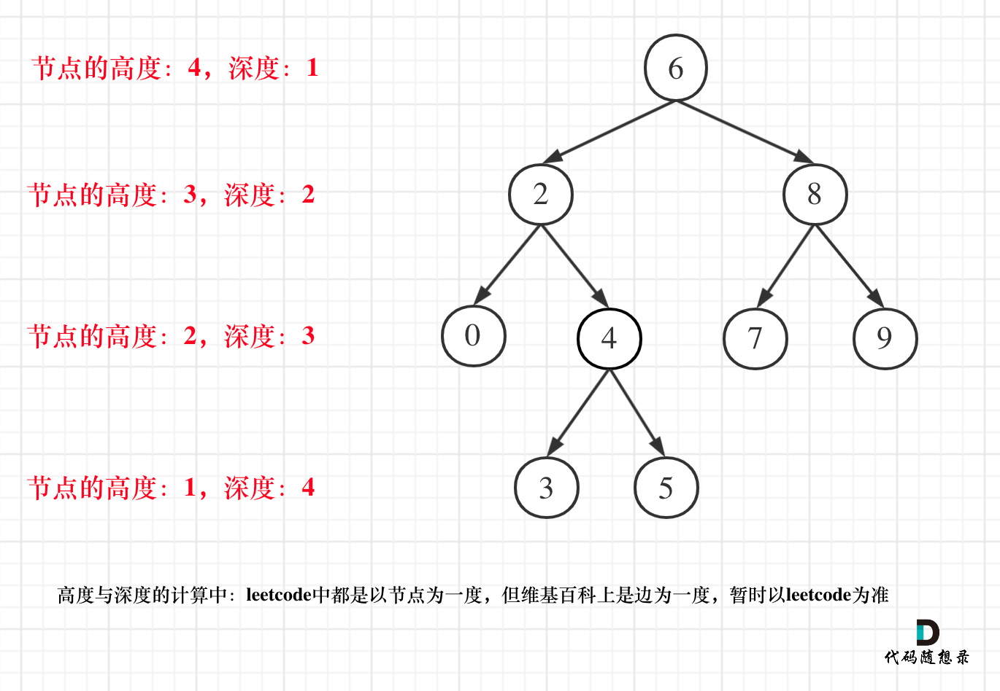

1.确定递归函数的参数和返回值：参数就是传入树的根节点，返回就返回这棵树的深度，所以返回值为int类型。
2.确定终止条件：如果为空节点的话，就返回0，表示高度为0。
3.确定单层递归的逻辑：先求它的左子树的深度，再求的右子树的深度，最后取左右深度最大的数值 再+1 （加1是因为算上当前中间节点）就是目前节点为根节点的树的深度。

## 二叉树高度vs深度
二叉树节点的深度：指从根节点到该节点的最长简单路径边的条数。
二叉树节点的高度：指从该节点到叶子节点的最长简单路径边的条数

4:求深度可以从上到下去查 所以需要前序遍历（中左右），而高度只能从下到上去查，所以只能后序遍历（左右中）

如果需要遍历整棵树，递归函数就不能有返回值。如果需要遍历某一条固定路线，递归函数就一定要有返回值！

如果需要搜索整棵二叉树且不用处理递归返回值，递归函数就不要返回值。（这种情况就是本文下半部分介绍的113.路径总和ii）
如果需要搜索整棵二叉树且需要处理递归返回值，递归函数就需要返回值。 （这种情况我们在236. 二叉树的最近公共祖先中介绍）
如果要搜索其中一条符合条件的路径，那么递归一定需要返回值，因为遇到符合条件的路径了就要及时返回。（本题的情况）

要知道中序遍历下，输出的二叉搜索树节点的数值是有序序列。